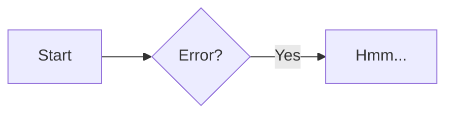

# AGENTS.md

## 项目概览

- 项目名：ramonmi.github.io（Ramon's Notes）
- 类型：个人博客 / 笔记站点，部署在 GitHub Pages
- 站点地址：https://ramonmi.github.io/
- 仓库：https://github.com/ramonmi/ramonmi.github.io（`origin`，主干分支 `main`）
- 内容语言：中文为主，Markdown 写作
- 项目起始日期：2023-01-20

## 技术栈与架构

| 组件 | 说明 |
|---|---|
| 静态站点生成器 | [Zensical](https://zensical.org)（MkDocs 系，TOML 配置） |
| 构建配置 | 根目录 `zensical.toml` |
| 内容源 | `docs/`（Markdown） |
| 构建产物 | `site/`（已 gitignore，由 CI 生成） |
| 运行时 | Python >= 3.14（见 `.python-version`） |
| 依赖管理 | `uv`（`pyproject.toml` + `uv.lock`，dev 依赖 `zensical`） |
| 部署 | GitHub Actions（`.github/workflows/gh-pages.yml`） |

## 目录结构

```text
.
├── .github/workflows/gh-pages.yml   # CI/CD：push main 自动构建并部署
├── .vscode/settings.json            # Markdown 4 空格缩进
├── .gitattributes                   # * text=auto eol=lf
├── .python-version                  # 3.14
├── pyproject.toml                   # uv 项目元数据
├── uv.lock                          # 依赖锁文件
├── zensical.toml                    # 站点核心配置（导航/主题/扩展）
├── docs/                            # 内容源（Markdown）
│   ├── index.md                     # 首页
│   ├── about-me.md                  # 关于页
│   ├── assets/                      # favicon、logo 等静态资源
│   └── miscellaneous/               # 杂项笔记
└── site/                            # 构建产物（忽略）
```

## 核心配置（zensical.toml）

- site 元信息：`site_name`、`site_description`、`site_author`、`site_url`、`copyright`
- `docs_dir = "docs"`，`site_dir = "site"`，`use_directory_urls = true`
- `repo_url` / `edit_uri`：指向 GitHub 仓库，支持 "Edit this page"
- 导航：`nav` 显式定义，一级为 Home / Miscellaneous / About；新增文档需同步更新 `nav`
- 主题：`variant = "modern"`，`language = "zh"`，favicon/logo 为 `assets/favicon.svg`
- 配色：三套 palette（跟随系统 / light / dark）
- 功能开关：`navigation.*`、`search.*`、`toc.*`、`content.*` 等大量特性（见 `[project.theme].features`）
- Markdown 扩展：admonition、attr_list、footnotes、toc、pymdownx 全家桶（highlight、superfences、tabbed、tasklist、emoji 等）、mermaid 自定义 fence、glightbox
- 社交媒体：`[project.extra.social]`（GitHub、Email）

## 构建与部署

本地构建路径（依赖 uv 与 zensical）：

```bash
uv run zensical build --clean
```

CI 流程（`.github/workflows/gh-pages.yml`）：

1. push 到 `main` 触发
2. `actions/checkout` + `actions/setup-python`（Python 3.14） + `astral-sh/setup-uv`
3. `uv sync --all-extras --dev`
4. `uv run zensical build --clean`
5. `actions/upload-pages-artifact` 上传 `site/`，`actions/deploy-pages` 发布

## 开发约定

- 新增/修改文档：编辑 `docs/` 下 Markdown，必要时同步 `zensical.toml` 的 `nav`
- 静态资源放入 `docs/assets/`
- 提交信息遵循 Conventional Commits（见全局规范）
- 不在 `site/`、`.venv/`、`.cache/` 中提交内容（均已 gitignore）
- 不直接修改 `uv.lock`，依赖变更通过 `uv` 管理

## Markdown 语法规范（Zensical）

> 来源：https://zensical.org/docs/authoring/markdown/ 及 Authoring 系列页面（admonitions、code-blocks、lists、footnotes、icons-emojis、diagrams、images、formatting、math、content-tabs、tooltips、buttons、grids、data-tables、frontmatter 等）
> 渲染引擎：Python Markdown（兼容 Material for MkDocs 语法），并支持 Python Markdown Extensions。

### 基本原则

- Zensical 使用 Python Markdown，与 Material for MkDocs 语法兼容
- 列表项多段落、admonition 等内容必须使用 **4 个空格**（或 Tab）缩进，2 空格不生效
- 换列表符号不会新建列表（如 `*` 换成 `-` 仍属同一列表），与 CommonMark 行为不同
- 页面内链接应指向 **Markdown 源文件**（相对路径），不要链接生成的 HTML；Zensical 会自动转换为正确 URL
- 优先使用相对链接，避免绝对路径（站点迁移 `site_url` 时无需改动）
- 避免同一目录同时存在 `README.md` 和 `index.md`（行为未定义）

### 页面标题优先级

1. `zensical.toml` 中 `nav` 定义的标题
2. Markdown front matter 中的 `title`
3. 页面内一级标题（`# ...`）
4. Markdown 文件名（兜底）

### Front matter（页面元数据）

```markdown
---
title: 页面标题
description: 页面描述（写入 HTML head meta）
icon: lucide/braces
status: new        # 需在 zensical.toml 的 [project.extra.status] 定义
template: my_homepage.html   # 自定义模板（需配置 overrides 目录）
---
```

### 代码块

- 围栏代码块（```python 等）由 Pygments 高亮
- 行号：```` ``` py linenums="1" ````（`linenums` 从 1 或不指定）
- 高亮指定行：```` ``` py hl_lines="2 3" ```` 或 `hl_lines="3-5"`（行号从 1 计）
- 行号锚点利于分享：```` ``` py linenums="1" ```` 可配合 `content.code.select` 选择行范围
- 复制/选择按钮（按代码块粒度，需启 `content.code.copy` / `content.code.select`）：
  ```` ``` { .yaml .copy } ````、```` ``` { .yaml .no-copy } ````、```` ``` { .yaml .select } ````、```` ``` { .yaml .no-select } ````
- 代码注解（`content.code.annotate`）：在注释中写 `# (1)!`，随后在代码后缩进 4 空格写注解内容
- 内联代码高亮：`` `#!python range()` ``（`#!` + 语言短代码）
- 嵌入外部文件：```` ``` title=".browserslistrc"
  --8<-- ".browserslistrc"
  ``` ````

### Admonitions（提示框）

- 基本语法：`!!!` + 类型关键字，内容缩进 4 空格
  ```markdown
  !!! note
      Lorem ipsum dolor sit amet...
  ```
- 自定义标题：`!!! note "自定义标题"`（标题可含 Markdown）
- 可折叠（配合 `pymdownx.details`）：`??? note` / `???+ note`（默认展开）
- 可嵌套：内部 admonition 再缩进
- 支持类型：`note`、`abstract`、`info`、`tip`、`success`、`question`、`warning`、`failure`、`danger`、`bug`、`example`、`quote`
- GitHub callouts（需启用 `pymdownx.quotes` 的 `callouts`）：
  ```markdown
  > [!NOTE]
  > 内容
  ```
  标记必须全大写：`[!NOTE]`、`[!TIP]`、`[!WARNING]`、`[!IMPORTANT]`、`[!CAUTION]`

### 列表

- 无序列表：`-`、`*`、`+` 可混用
- 有序列表：`1.` 开头，数字不必连续（可全写 `1.`，渲染时自动重排）
- 定义列表（`def_list`）：
  ```markdown
  `术语`
  :   定义内容
  ```
- 任务列表（`pymdownx.tasklist`）：
  ```markdown
  - [x] 已完成
  - [ ] 未完成
  ```
- 嵌套列表项须缩进 4 空格

### 表格

- 标准 Markdown 表格（Github 风格）：
  ```markdown
  | Method | Description |
  | ------ | ----------- |
  | GET    | Fetch      |
  ```
- 列对齐：`| :--- |` 左对齐、`| :---: |` 居中、`| ---: |` 右对齐
- 表格内可放图标、行内代码
- 排序表（可选，需 `tablesort` 脚本）：标准表格加 sortable 类后点击列排序

### 脚注

- 引用：`文本[^1]`
- 定义（单行）：`[^1]: 脚注内容`
- 定义（多行，缩进 4 空格）：
  ```markdown
  [^1]:
      Lorem ipsum dolor sit amet...
  ```
- 自动渲染在页面底部，自动添加返回链接；`content.footnote.tooltips` 可悬停显示

### 图标与 Emoji

- Emoji：`:smile:`（冒号包裹 shortcode，Twemoji 渲染）
- 图标：`:fontawesome-regular-face-laugh-wink:`（路径 `/` 换成 `-`）
- 图标加类/颜色：`:octicons-heart-fill-24:{ .heart }`（需 `attr_list`）
- 内置图标集：Lucide、Material、FontAwesome、Octicons、Simple Icons

### 图片

- 对齐（需 `attr_list`）：
  ```markdown
  { align=left }
  { align=right }
  ```
  （不支持居中；居中可用图片说明语法）
- 图片说明（需 `pymdownx.blocks.caption`）：
  ```markdown
  /// caption
  
  ///
  ```
- 懒加载标记：`{ loading=lazy }`

### 格式化

- 高亮：`==标记文本==`
- 插入（下划线）：`^^插入文本^^`
- 删除线：`~~删除文本~~`
- 上标：`A^T^`
- 下标：`H~2~O`
- 键盘键：`++ctrl+alt+del++`

### 数学公式（`pymdownx.arithmatex`，需 MathJax 或 KaTeX 脚本）

- 块级：`$$ ... $$` 或 `\[ ... \]`（独占行）
- 行内：`$ ... $` 或 `\( ... \)`

### Mermaid 图表（已配置 custom_fences）

````markdown

````

- 官方支持类型：flowchart、sequenceDiagram、classDiagram、stateDiagram-v2、erDiagram
- 其他类型（pie、gantt、journey、gitGraph、requirementDiagram）可用但不保证移动端效果

### Content tabs（内容标签页，`pymdownx.tabbed`）

- 基本语法：`=== "标签名"`，内容缩进 4 空格
  ```markdown
  === "C"
      ``` c
      #include <stdio.h>
      ```
  === "Python"
      ``` python
      print("Hello")
      ```
  ```
- 可嵌套在其他块（admonition、blockquote）中
- `content.tabs.link` 启用后，全站同名标签联动

### 提示框/Tooltips（`abbr` + `attr_list` + `pymdownx.snippets`）

- 链接标题：`[悬停](https://example.com "提示文字")`
- 缩写定义：
  ```markdown
  HTML 规范由 W3C 维护。
  *[HTML]: Hyper Text Markup Language
  *[W3C]: World Wide Web Consortium
  ```
- 全站术语表：把 `*[缩写]: 定义` 放到独立文件（建议 `includes/abbreviations.md`，放在 `docs/` 外），再配置 `pymdownx.snippets.auto_append`

### 按钮（`attr_list`）

- 普通按钮：`[订阅](#){ .md-button }`
- 主按钮（填充）：`[订阅](#){ .md-button .md-button--primary }`
- 带图标：`[发送 :fontawesome-solid-paper-plane:](#){ .md-button }`

### Grids（网格，`attr_list` + `md_in_html`）

- 卡片网格：`<div class="grid cards" markdown>` … `</div>`，卡片用 `- :octicons-...:` 列表项
- Grid 布局：`<div class="grid" markdown>` … `</div>`

### 本项目已启用的扩展与特性

- 已启用：admonition、attr_list、def_list、footnotes、md_in_html、abbr、toc(permalink)、pymdownx.{arithmatex, betterem, caret, details, emoji, highlight, inlinehilite, keys, magiclink, mark, smartsymbols, superfences(mermaid), tabbed, tasklist, tilde}、glightbox
- 已启用主题特性：navigation.*、search.*、toc.follow、content.{tabs.link, tooltips, code.copy, code.select, code.annotate, action.edit, action.view, footnote.tooltips} 等
- 因此可直接使用：admonitions（含 `???` 折叠）、任务列表、定义列表、脚注、代码高亮/复制/选择/注解、内联代码高亮、图标/Emoji、Mermaid、内容标签页、数学公式扩展、格式化、按钮、grid、tooltips
- 未启用（需先配置）：`pymdownx.snippets`（外部文件嵌入/术语表 auto_append）、`pymdownx.quotes`（GitHub callouts）、`pymdownx.blocks.caption`（图片说明）、`zensical.directives`（变体/条件内容，Spark）、tablesort（排序表）
